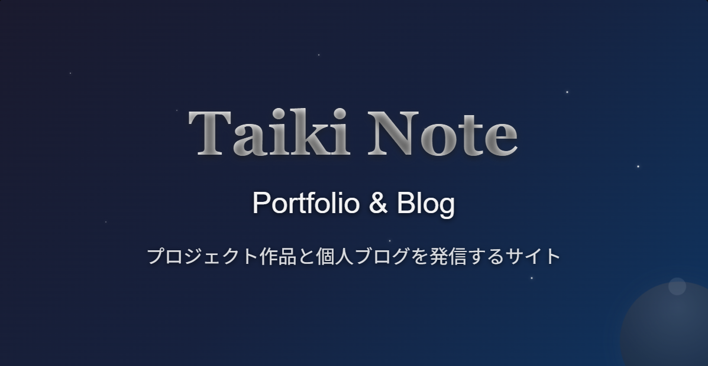
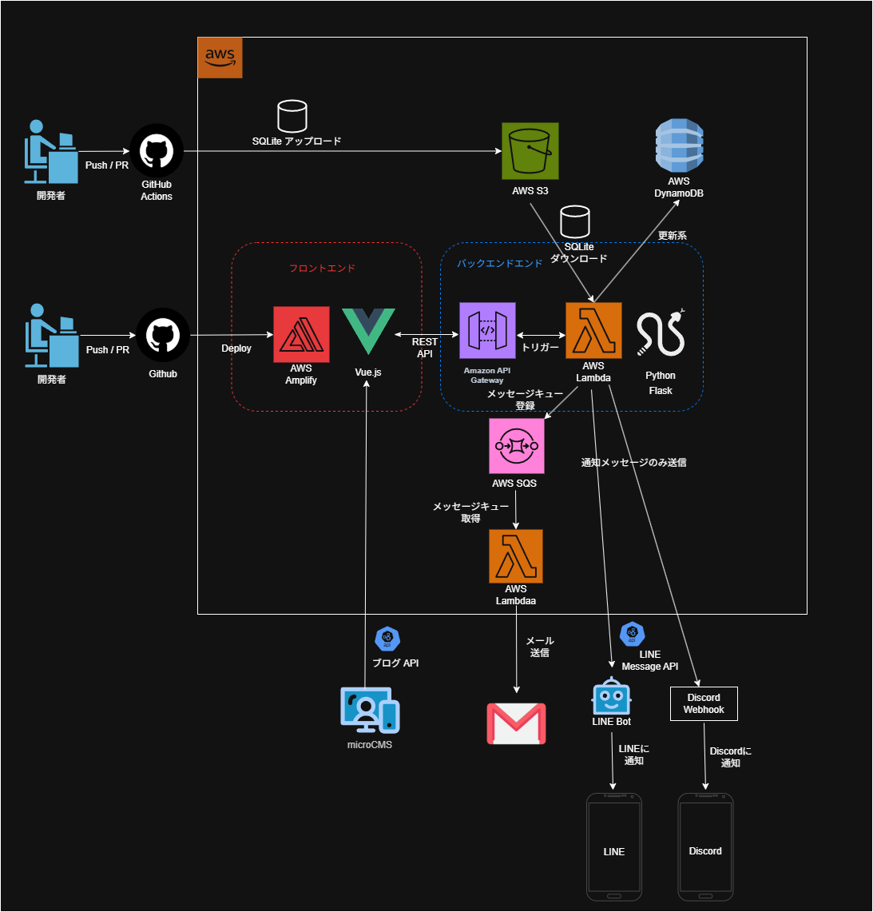
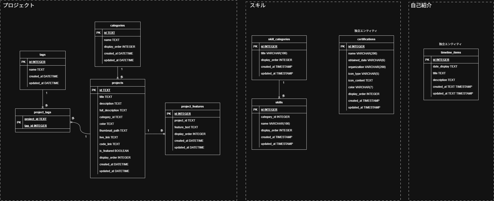

# 📖Taiki Note

私が作成したポートフォリオ & ブログサイトです。
https://release.dxteineyxq92b.amplifyapp.com/

# 🌟主な機能

- 🏠 ホーム: プロジェクト紹介・自己紹介プレビュー
- 👤 自己紹介: プロフィール・経歴タイムライン・価値観
- 📁 プロジェクト: 作品ポートフォリオ・カテゴリフィルタ・詳細ページ
- 🛠️ スキル: 技術スタック・保有資格の表示
- 📝 ブログ: microCMS連携・記事検索・目次機能
- 📞 お問い合わせ: コンタクトフォーム
- 🎭 スペースキャンバス：お絵描き機能
- 🎵 BGM再生: サイト全体でのBGM制御

# システム構成図
このサイトは、以下のようなシステム構成で運用されています。

フロントエンドは`AWS Amplify`を利用してホスティングおよびデプロイを行い、Web上に公開しています。
バックエンドは`AWS API Gateway + AWS Lambda`を組み合わせたシンプルな構成でAPIを構築しています。

自己紹介やプロジェクト情報、スキル情報などのデータは`SQLite`にて管理されており、GitHubへのプッシュ時に`AWS S3`に自動アップロードされます。API呼び出しに応じて `AWS Lambda`が起動し、`AWS S3`からSQLiteファイルを取得・参照して処理を行います。また、メール送信回数などの更新情報は`AWS DynamoDB`を利用して保存・管理しています。

ブログ機能については、`microCMS`と連携し、記事を管理・公開しています。

メール送信処理には`AWS SQS + AWS Lambda`を組み合わせて非同期に処理を実行しており、メールが送信されると、LINEとDiscordに通知が送られる仕組みにしています。

    

# ER図
このサイトで使用しているSQLiteのER図です。

